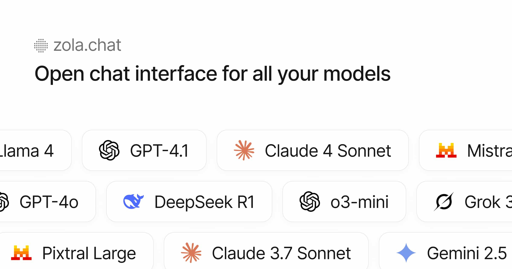

# Zola

Zola is the web UI for the Hermes agent, served at chat.kryos.dev. It installs
as a PWA from the browser.



## Develop

```bash
cp .env.example .env.local   # fill in, see INSTALL.md
npm install
npm run db:migrate
npm run dev
```

## Build

```bash
npm run type-check
npm test
npm run build
docker build -t zola .
```

Configuration is documented in [INSTALL.md](./INSTALL.md). Licensed under Apache 2.0.
